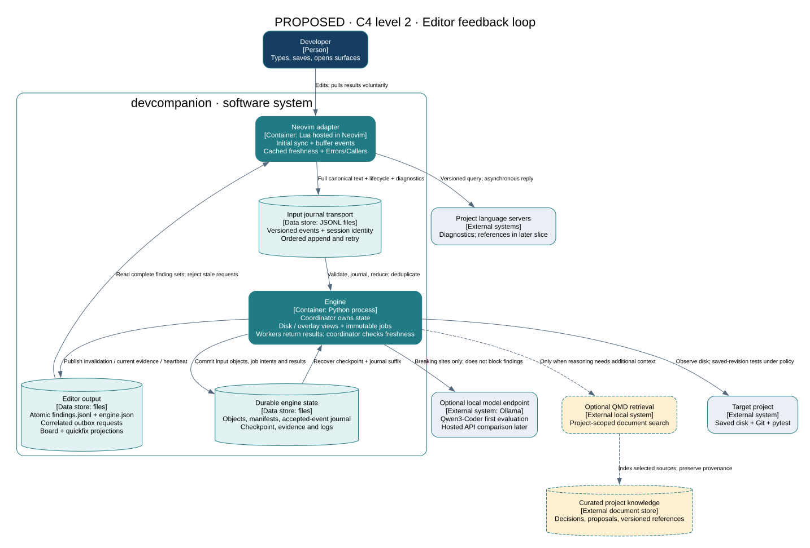
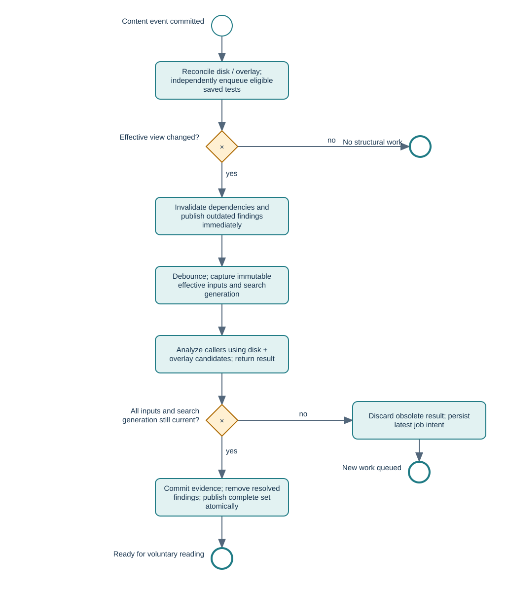

# Completing the editor feedback loop

Status: **largely implemented, 2026-09-14** (second pass). Kept as written, with this note.

This was the proposal; steps 1–5 of "the experience to build" below are now built and verified —
including step 1's announcement of already-open buffers —
with two deliberate differences from the text. There is one pane, `:CompanionPanel`, rather than
separate Callers and Errors windows — `:CompanionCallers` and `:CompanionErrors` are that pane
filtered. And the Lua layering ends `collect → transport → findings → panel`: the renderer named
below became a store with no windows in it.

Step 6, restarting either side and recovering pending work, is **not** done: the inbox tail still
has no durable watermark. That is the top item in the [handoff](handoff.md)'s next order.

See [contract v2](contract.md) for the protocol as built, [canonical text](text-canon.md) for the
hashing rule this design called for, and [the check run](workflow/test-results.md) for what is
actually asserted. Product choices below remain proposed defaults, not agreed requirements.

Model evaluation preference: **local Qwen3-Coder before hosted APIs**, with an installed-model fallback if it is not viable on this machine. See [local evaluation and optional QMD context design](local-model-and-context.md). The evidence-only model experiment can run before the implementation slices below; QMD retrieval is an optional extension for context-sensitive explanations.

## The experience to build

1. Open a Python project and run `:CompanionStart`. The adapter sends initial contents of loaded project buffers, so the engine does not wait for the next edit to learn about them.
2. Add a required parameter without saving. After the typing debounce, the engine checks affected callers against the editor contents. It does not open anything.
3. Open `:CompanionCallers` or `:CompanionErrors`. A caller finding identifies a location, explains the mismatch and links the exact code evidence. Structural predictions are labelled **inferred**, not an observed runtime failure.
4. Edit the caller. Its old finding immediately becomes stale locally. Once analysis completes, the finding disappears if resolved, even if neither file has been saved.
5. Save. The saved revision becomes eligible for a background test run under project policy. A failed test appears in Errors with its actual execution result. A passing run clears the corresponding failure.
6. Restart either side. Reconnect, synchronize current buffers and recover pending work. Old findings are not silently presented as current.

Proposed first-milestone policy: unsaved caller analysis; tests after saves. Testing unsaved code would require a separate materialized execution workspace. That option can be added without changing the content model below.

## Boundaries and scope

Keep Python, Lua, JSONL transport, a local snapshot store and the existing deterministic caller analysis. Models remain optional suggestions over evidence; there is no model call per keystroke or save.

Ship Errors and Callers with real engine output. Board and quickfix remain alternative projections of the same current evidence. Goal messages must be safely accepted, but goal inference is not needed for this milestone. Wire diagnostics as observed editor reports; use LSP references as the next extension. Docs, Chat, Roadmap, test generation, action application and runtime Compare remain separate work.

The first release supports **one active observing Neovim session per workspace**. A second session may read results but cannot silently replace the first session's unsaved contents. Engine status identifies the owner and explains the conflict. Multiple simultaneous editor views require session-scoped analysis and findings and are deferred deliberately. This is a proposed scope limit, not a property of current code.

## Architecture

The Python process has one coordinator that owns mutable runtime state. Producers enqueue events; the coordinator validates and commits them. Investigation workers receive immutable snapshot manifests and return result messages. Workers never directly mutate snapshot history, the evidence dictionary or presentation files. The coordinator is therefore the place for invalidation, deduplication and final publication checks.

Keep one investigation worker initially. Its slow tool/model calls must not block event ingestion or stale marking. Later worker concurrency does not alter this ownership rule.

## Two content views, one explicit input manifest

Maintain these separately for each project-relative path:

| State | Meaning | Updated by |
|---|---|---|
| Disk revision | Last verified saved bytes, raw object reference and canonical text hash | Filesystem event or disk verification after save |
| Editor overlay | Active session's canonical text, text hash, document version and dirty flag | Initial sync, buffer change, save, close |
| Effective revision | Overlay when active and different from disk; otherwise disk | Derived by the coordinator |
| Analysis manifest | Immutable mapping of every input read to its object reference and text hash, plus view/session/generation | Captured for a job; extended with newly read inputs before result commit |

Disk notifications never overwrite a dirty overlay. If external disk contents change under a dirty buffer, retain both and show a conflict in status; caller analysis continues against the editor view. Saving is verified against disk rather than trusted from `dirty:false` alone. A disk event arriving before the Lua save event updates disk state; the later matching save completes reconciliation without duplicate structural work.

Only a disk content change verified as persisted is a test trigger. An unsaved edit followed by a save of identical effective text still triggers the saved-revision test eligibility check even though no new structural analysis is needed. Test deduplication uses saved revision + affected symbols + policy, not only the effective SHA.

Closing/unloading a buffer releases its overlay and returns the effective view to disk, invalidating dependent findings if necessary. A rename is an explicit old-path deletion plus new-path observation; no stale old-path overlay survives it. Disk deletion is a tombstone that invalidates dependencies. If a dirty overlay survives deletion, it is explicitly an editor-only file and ineligible for disk tests.

### Canonical text and hashing

Use a versioned `utf8-lf-v1` representation for editor comparisons: UTF-8 text, LF line endings, preserving whether a final newline exists. Lua serializes buffer lines joined with LF and includes the trailing LF when `endofline` is true. The disk reader decodes supported UTF-8 (optional BOM), normalizes CRLF to LF and preserves final-newline presence. Exclude the BOM from canonical text but retain original raw bytes in the object store. Unsupported encodings/binary input yield an explicit unsupported observation; never silently decode with replacement characters.

`text_sha` is the full SHA-256 of canonical UTF-8 bytes. `content_sha` remains an object-store reference to raw stored bytes and is not compared directly with a live-buffer hash. New editor objects store canonical bytes; disk objects retain exact bytes. Each manifest entry carries both. Golden Lua/Python fixtures cover empty text, final newline, multiple trailing newlines, CRLF, BOM and Unicode.

For the new findings protocol, `depends_on` maps paths to canonical text hashes; `hash_format` is `sha256:utf8-lf-v1`. This changes semantics from the draft contract and therefore requires schema version 2 on new wire envelopes and findings. Legacy CLI/replay logs remain readable through a separate internal event decoder; do not reinterpret old short object hashes as new text hashes. Unsupported editor protocol versions are reported as incompatible rather than partly accepted.

### Unsaved callers matter too

Resolve all caller reads through the effective view. Candidate paths are the union of disk search results and overlay paths whose text may contain the name. This includes new unsaved callers and filters calls removed in an overlay. Freeze each candidate's actual bytes before parsing; store its dependency hash in the result.

Track searched symbol names as dependencies as well as known file paths. An edit adding a previously unknown caller must requeue the relevant symbol investigation; a dependency map of old callers alone cannot discover it. A simple first implementation extracts call names from each edited Python file and invalidates investigations for affected names, with a conservative broader recheck on parse failure.

Snapshot history entries have revision IDs and explicit predecessor IDs. A→B→A is three observations even though A reuses an object. Jobs compare revisions, not the first historical occurrence of a SHA. Keep the last parseable structural baseline through temporary syntax errors. Maintain unresolved symbol investigations across body-only edits so that a `noop` delta does not accidentally erase an outstanding caller mismatch. Re-evaluate those obligations against current signatures; a signature revert can resolve them.

## Intake, durability and restart

Route on `kind` before accessing path or text. `text` in a goal is not source code. Required fields are validated per kind.

| Event | Required handling |
|---|---|
| `session_start`, `sync_complete` | Negotiate v2 capabilities, claim the active editor view, synchronize loaded buffers |
| `buffer_changed`, `buffer_saved` | Validate text/hash; reject older document versions; commit overlay; verify disk on saves |
| `buffer_closed`, `session_stop` | Release overlays, invalidate dependencies and re-evaluate disk view |
| `diagnostics` | Replace that buffer's diagnostic set, including empty clears; retain version/source provenance |
| `cursor` | Update attention context; never create a content revision |
| `goal` | Store contextual text; do not snapshot or run code |
| `lsp_result` | Correlate an outstanding request; reject expired/mismatched replies |
| `dismiss`, `request` | Validate and route; return an explicit unsupported result until that capability exists |
| Unknown/malformed input | Record a bounded rejection reason and continue processing subsequent lines |

Keep producer identity `(session, seq)` separate from the engine's monotonically increasing `event_id`. Do not overwrite the producer sequence. Within one session, document versions prevent late changes from rolling buffers backwards. Same-version matching messages may still convey a save or diagnostics; deduplication must not discard those distinct kinds.

Use the accepted-event journal as the durable authority:

1. Validate input; persist referenced content objects before committing the accepted event.
2. Append and flush the accepted event with identity and object refs. The journal is the durable acknowledgement point.
3. Reduce accepted events into runtime state, pending job intents and evidence invalidations. Atomically checkpoint that combined state with the last reduced event ID.
4. Only dispatch jobs whose intent is durable. On restart, load the checkpoint and reduce subsequent journal events before dispatching recovered work.
5. Commit accepted worker results through the same coordinator/journal path. Regenerate presentation from committed evidence.

The inbox byte offset is an optimization, not the correctness key. Persist file identity, offset and producer watermarks, and reconstruct accepted identities from the journal suffix after a crash. A partial final inbox line is retried. A malformed complete line advances the physical offset with a rejection record. Detect truncation/replacement and rescan with identity deduplication.

Promise **idempotent event effects and at-least-once recoverable computation**, not exactly-once tool execution. A crash between a test finishing and its result being committed can require another run. Journaled job/result IDs prevent duplicate findings. This explicitly replaces the draft's overly broad “never reprocesses” invariant.

Lua retains queued lines until the asynchronous append completes successfully, handles short writes and retries failed appends in order. Same bytes and sequence are reused for a retry; duplicates are safe at the engine. A per-workspace process lock permits only one engine writer. For this milestone, do not rotate a live inbox or collect referenced snapshots; report storage usage and defer a coordinated retention protocol.

On engine restart, give the adapter a new `engine_instance` ID in status. The adapter sends a full buffer synchronization; no old overlay is trusted as live before completion. A crashed editor cannot send `session_stop`: persisted overlay findings remain outdated while awaiting resynchronization. A new session explicitly takes ownership after the old session is confirmed disconnected; merely missing a content event is not proof of disconnect. Use a lightweight session heartbeat/lease (no inference) and mark an expired session disconnected after a configurable grace period. Proposed defaults: heartbeat 5 s, expiry 20 s. Never silently lose unsaved snapshots on expiry.

## Findings and publication

[BPMN 2.0 XML with diagram layout](workflow/proposed/feedback.bpmn) describes the effective-content analysis branch. Save reconciliation and test eligibility are a separate activity, so unchanged content does not suppress a newly eligible saved test.

On any dependency change, invalidate affected findings and publish that stale/resolved state immediately; do not wait for another slow bundle. Before committing a worker result, compare every manifest dependency and the relevant symbol-search generation to current state. If anything changed, discard the fresh-result proposal and queue the latest job. Cancellation is an optimization; this final check is the correctness mechanism. Apply it after model requests and test execution too.

### Projection rules

| Internal observation | Surface and representation |
|---|---|
| Caller argument mismatch | Callers: `caller_affected`, basis `inferred`, location at call site, exact signature and snapshot evidence |
| Ambiguous call (`*args`, uncertain binding) | Callers: inferred uncertainty; never worded as an observed exception |
| LSP diagnostic | Errors: `diagnostic_context`, basis `observed`, source/code/message/version; observing a diagnostic does not prove a runtime failure |
| Failed pytest run | Errors: `test_result`, basis `observed`, failure location when available or explicit test-file scope, saved execution manifest and log ref |
| Passing test / caller fits | Remove the matching failure/mismatch from active surfaces; retain execution history and board summary |
| Mid-edit parser error | Status “analysis waiting for parseable text”; previous dependent findings outdated; no duplicate error if LSP already explains it |
| Noop / coalesced / unavailable model | Status or internal log; no attention-demanding finding |

IDs derive from semantic identity (kind, defining symbol, caller path and stable AST location key), not generation, timestamp or model wording. A line-number-only move updates the existing finding. If stable matching is ambiguous, replace the old record explicitly rather than merge unrelated claims. Keep original evidence basis plus a separate freshness field; adapt the legacy `outdated` display marker at the rendering boundary.

Each current finding includes `schema_version`, `id`, `surface`, `title`, `basis`, `freshness`, `location` or `scope`, `consequence`, checkable `evidence`, `depends_on`, `hash_format`, `snapshot_id`, `generation`, `engine_instance` and `created_ts`. Evidence refs resolve to persisted objects/manifests/test logs, not only a suggestive string. Suggestions are explicitly optional model annotations, never a substitute for consequence/evidence. No action button is emitted until action execution and freshness checking exist.

Publish complete `findings.jsonl` by writing a unique temporary file in the same directory, flushing and renaming. Publish an empty file when the final finding resolves. Update board/quickfix from the same generation; each is independently atomic, but do not claim a cross-file transaction. Include generation in findings and status for diagnostics. The adapter consumes findings as a self-contained set and never needs status to interpret a partial finding. Keep the last good set on a malformed replacement and label it outdated.

Renderer state must be keyed by workspace and surface, rather than today's global surface buckets. Add `:CompanionCallers`. Rendering never opens or focuses a surface except on a user command. Check cached live-buffer hashes on local text changes to dim/hide outdated findings even before a new findings file arrives. Closing buffers removes their live-hash cache and triggers the overlay release protocol. Unknown freshness is shown as unknown/outdated, not assumed current because a file is unopened.

## Saved tests and optional models

For the first milestone, preserve the existing selected-pytest capability but label it accurately: **executed against saved working-tree content**. It is not proof about an unsaved overlay. Capture selected test files, known source dependencies, interpreter/config and before/after disk identities. If a known execution input changes during the run, publish it as outdated or discard and reschedule. Filesystem generation checks are conservative aids; imported dependencies and external state are not comprehensively isolated. Do not claim reproducible snapshot execution until a separate materialized runner exists.

When the effective view differs from the tested disk revision, the editor displays any relevant test evidence as “saved revision; current buffer differs,” never a fresh verdict on the overlay. Project policy controls whether saves run tests. Proposed initial options: `off` and `run_saved`; draft/incorporate policies belong to future test generation.

Model requests receive breaking sites only and a bounded evidence payload from the manifest. Use an explicit project backend/content-sharing setting, output validation and a timeout. A model result is accepted only if its parent evidence is still current. If the model is slow, publish deterministic findings first and add its sentence later; model work must not delay the useful result.

## Diagnostics and LSP bridge

First accept diagnostics without trying to explain causality. Capture buffer text identity at emission and label it the editor's reported context. Neovim `DiagnosticChanged` alone does not establish which source revision the language server analyzed. Carry provider document version when available; otherwise expose unknown analysis revision and do not claim that the most recent edit caused the error. Empty diagnostics clears that source/set explicitly. Invalidation happens on subsequent local changes.

Then implement one LSP request type: `references`. Outbox entries include `engine_instance`, target session, request ID, method, path, canonical hash, document version and deadline. The adapter responds only for the target session and matching current buffer; replies echo request identity and input version. Add `stale_input` and `cancelled` to response status alongside the draft's statuses. Timeouts have one terminal result, and late callbacks are ignored. Neither a restart nor a stale outbox line can trigger a new query: request identity, generation and deadline make it obsolete.

Normalize `Location` and `LocationLink` for references. Add definition, document symbols and hover separately because they have different result shapes. Positions on the wire are 1-based UTF-8 byte offsets; convert through each client's negotiated LSP encoding and test non-ASCII text. Until this works, keep Python tree-sitter/rg as the stated fact source and do not claim language-agnostic analysis.

## Liveness

Atomically publish `engine.json` on state changes and every 2 s with `engine_instance`, PID, version, schema/capabilities, workspace, `started_ts`, `heartbeat_ts`, coordinator state, pending jobs, latest accepted/reduced event IDs, active editor session, sync state and model status. Heartbeats perform no analysis. After 6 s without heartbeat, show unavailable; never infer liveness from file existence or PID alone. Restart produces a new instance ID. Explicit stop may publish stopped state; missing heartbeat covers crashes.

Fix adapter autostart to use the existing `companion watch` command; the current default is the nonexistent `companion serve`. The process lock makes manual start plus autostart safe. Engine status reads and rendering remain asynchronous or cached. Status exposes incompatibility, session conflict and unsupported input without popping notifications on every background event.

## Contract and implementation slices

Keep [contract v1](contract.md) as the historical draft until v2 is implemented. Add a v2 schema and golden cross-language fixtures before changing readers/writers. Do not silently change existing log interpretation.

| Slice | Main changes | Exit test |
|---|---|---|
| 1. Content correctness | Event routing; canonical hashes; disk/overlay index; initial sync/close; revision predecessors | Unsaved defining and caller edits both reach the effective view; disk stays untouched; A→B→A works |
| 2. Recoverable ownership | Coordinator; journal/checkpoint; worker result messages; durable job IDs; session/version checks; engine lock | Crash at acceptance/checkpoint/result boundaries and recover without lost work or duplicate findings |
| 3. Editor return path | Findings projection; immediate invalidation; final commit gate; atomic writers; workspace-scoped renderer; Callers/status commands | Open real findings, edit a dependency during slow work, see stale then resolved output without focus changes |
| 4. Save and test distinction | Save reconciliation; saved-revision eligibility; project policy; explicit execution context | Unsaved analysis does not run disk tests; saving identical effective content runs tests once; changed input cannot receive a fresh test verdict |
| 5. Diagnostic evidence | Per-kind diagnostic storage, clear semantics and version provenance | Report a diagnostic, clear it, deliver a stale report; current Errors remains truthful |
| 6. LSP references | Typed outbox, correlation/deadlines, reply normalization and encoding | Real/fake LSP success, unsupported, timeout, stale reply and restart all terminate correctly |
| 7. Optional suggestions | Breaking-only prompt; validate output; independent deadline/publication | Deterministic findings appear with model disabled, unavailable, slow or wrong-shaped output |

Code ownership: `observe/events.py` becomes the internal log decoder plus explicit wire normalization (prefer a new `transport/` module for protocol validation/tailing). `snapshot/` owns raw objects, canonical metadata and revisions. Add a `workspace/` content-view index. `engine.py` owns coordinator routing; `schedule/` owns pending job selection. Investigators return values. `evidence/` owns records, dependencies and reconciliation; `present/` owns projections and atomic publication. On Lua side preserve collect → transport → render layering; `init.lua` owns session/sync wiring and commands.

The first useful release needs slices 1–4 together. Diagnostics, LSP and models extend that release; they should not conceal an unfinished deterministic editor loop.

## Acceptance scenarios

- Real Neovim: unsaved signature change → two caller findings → unsaved caller fixes → no active mismatches. The source tree remains unchanged throughout.
- Unsaved caller newly added in an otherwise unreferenced file is included. Closing it with changes discarded removes its influence.
- Save after unsaved analysis: disk test eligibility changes even when effective hash does not; duplicate filesystem/Lua events do not run tests twice.
- Slow job/model/test finishes after an edit: no stale result becomes fresh, and deterministic output is not blocked by the model.
- Reversion, temporary parse failure, deletion and rename invalidate/reconcile findings correctly.
- Final resolution publishes an empty findings file and clears the open surface/quickfix without stealing focus.
- Lua/Python hash fixtures match across newline/encoding cases; diagnostics/LSP location tests include Unicode.
- Partial inbox append, duplicate sequence, malformed/pathless messages and incompatible protocol do not crash intake.
- Engine crash recovery, editor restart, session expiry, second editor conflict and stale outbox replies preserve explicit ownership and freshness.
- Two workspaces in one Neovim instance never share findings or hashes. The five existing unit tests and the saved-file workflow harness remain green.

## Choices for discussion

1. Confirm the first test policy: analyze unsaved contents now and test saved code, or include a materialized unsaved runner in the milestone.
2. Confirm one active editor view per workspace initially; concurrent independent dirty buffers need a larger design.
3. Keep Errors and Callers as the first visible surfaces; agree whether passing-test summaries should stay in status/board only.

The defaults above make a small, testable release while keeping future isolation and language-server analysis compatible with the same manifest/evidence boundary.
