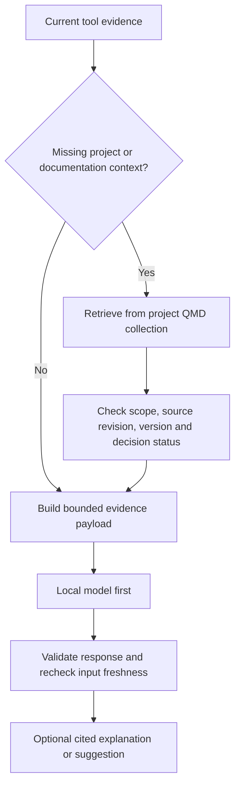

# Local model evaluation and optional knowledge retrieval

Status: design/evaluation plan, 2026-09-14. User preference: evaluate Qwen3-Coder locally before any hosted API model. If it cannot run on this machine, select an installed model. No remote fallback is automatic.

**Measured outcome:** Qwen3-Coder 30B loaded successfully at 4K context, with 70% CPU / 30% GPU allocation. The 12-request smoke test produced correct fixes in 1.58–2.38 s per request after loading. See [local model results and limits](evaluations/local-model-results.md). The installed 3B coder was also measured as a fast comparison; Qwen3-Coder remains the primary local evaluation candidate.

## The next experiment

First test the implemented one-sentence suggestion path with the real local runtime, before involving retrieval or a hosted model. Use alternating recorded/synthetic caller cases, ten repetitions per condition, with two payload variants: today's mixture of passing and breaking callers, and breaking callers only. Record full replies, model digest/quantization, runtime version, effective context setting, resident CPU/GPU allocation, load time and warm latency. A token/file-name check catches simple mistakes but is not a substitute for reading the responses.

Harness: [evaluate-local-model.py](../scripts/evaluate-local-model.py). It uses the existing client, a 4,096-token context setting and its existing 60-token output limit/30-second request deadline. Model loading is timed separately with a longer deadline. It only addresses `127.0.0.1:11434`; it does not download models or use a hosted endpoint.

The 30B model package is approximately 19 GB; fitting the weights does not imply a useful latency or enough memory for its advertised maximum context. The current machine has a Ryzen 7 5800X3D, 46 GiB physical RAM (38 GiB available at inspection), an RTX 2080 SUPER with 8 GiB VRAM, and 94 GiB free disk. This supports trying a small context with partial GPU offload. Actual load and performance must be measured. [Ollama Qwen3-Coder model information](https://ollama.com/library/qwen3-coder).

If loading fails or the bounded request deadline is unusable, use installed `qwen2.5-coder:3b` as the next candidate. Prior handoff measurements support trying it, but they do not establish today's result. `qwen3:4b` is a different model family member, not a smaller Qwen3-Coder, and its current-client behavior was problematic in the earlier handoff.

## How much context?

These are starting **input budgets**, not measured requirements, reserved windows or model limits. Count the actual tokenizer input, including instructions, metadata and evidence; reserve output capacity separately. Start with genuine short evidence, not padding to hit a target.

| Task | Starting input budget | Necessary context |
|---|---:|---|
| One-sentence caller suggestion | Up to 500–1,500 tokens | Signature delta, breaking calls, tool verdicts, locations |
| Diagnostic explanation | 2,000–4,000 tokens | Diagnostic provenance, relevant code/change, selected API reference if needed |
| Pick a useful investigation | 3,000–6,000 tokens | Current evidence, explicit goal if present, applicable project rules |
| Requested architecture discussion | 8,000–16,000 tokens | Goal, current architecture, accepted decisions, relevant alternatives/code |

Current suggestion fixtures are much smaller than the first ceiling. Begin at the existing 4K runtime window and only raise it when a real task's measured input needs it. For each larger workload, measure prompt ingestion time, output time and memory again. Use the same selected evidence and scoring cases for any later hosted-model comparison.

## Knowledge base + QMD

QMD is a local retrieval option for Markdown: keyword search, semantic retrieval and hybrid retrieval with reranking. Its keyword `search` avoids an LLM; semantic/hybrid modes introduce their own model/runtime costs. It exposes structured CLI output and MCP. [QMD documentation](https://github.com/tobi/qmd).

QMD is already installed on this machine. An isolated keyword-search smoke experiment indexed copies of five project documents in `/tmp/devcompanion-qmd-tw9rn4lw`; the three queries took 0.112–0.117 s each. This establishes basic local retrieval, not semantic/hybrid quality or integration with the companion. [Raw smoke results](evaluations/qmd-keyword-smoke.json). Prefer a project-scoped, explicitly selected collection. Do not query an unrestricted global index containing unrelated personal/project material.

The knowledge base owns project meaning; QMD finds passages. Neither supplies fresh code facts.

| Input | Authority |
|---|---|
| Unsaved/current saved code | Editor overlay + snapshot manifest |
| Callers, diagnostics and execution outcomes | Tools, with their freshness/provenance limits |
| Architecture, conventions, decisions, domain language | Curated project Markdown with status/revision |
| Library behavior | Locally captured documentation matched to dependency versions |

Proposed flow:

Retrieval is an optional reasoning dependency; it never blocks deterministic caller findings. A missing required reference leads to an explicit limitation, not an invented answer. A missing optional reference falls back to evidence-only output.

## Curating the initial collection

Start with the existing vision, contract, design, handoff and verified workflow results. Preserve their dates and status: the handoff describes a historical state, the new feedback design is a **proposal**, and neither becomes an implemented fact merely by ranking highly. Add a small manifest alongside the indexed files:

- Source path and heading/span; content hash and captured revision/date.
- Category: current implementation evidence, accepted decision, proposal, historical note, or external reference.
- Project/worktree scope; supersedes/superseded-by when applicable.
- Dependency name/version for external API references.

These are companion-owned provenance fields, not claims that QMD automatically enforces them. The context builder uses the manifest to filter results and attach citations. Source code and unsaved buffers stay out of this documentation collection; they arrive directly through live manifests.

Store retrieved query, source identifiers, exact selected passages and hashes with the reasoning job, so its inputs remain inspectable after an index rebuild. Invalidate a pending explanation if a required source changes. Treat retrieved text as evidence, not executable instructions or permission to change backend policy.

## Evaluate retrieval separately

Run the same context-sensitive questions under four conditions:

1. Evidence only.
2. Evidence plus a manually selected correct reference (tests whether additional knowledge can help).
3. Evidence plus QMD keyword retrieval.
4. Evidence plus QMD hybrid retrieval/reranking.

Use questions whose answer depends on a real project convention or decision, plus controls where no retrieval is needed. Include conflicting old/new documents, proposals presented beside accepted decisions, absent answers and irrelevant hits. Label required references before running retrieval.

Measure retrieval recall for those references, grounded answer correctness, unsupported claims, status/version mistakes, total input tokens, cold/warm retrieval latency, model latency and peak resident memory. Measure QMD and the generator **together** too: they may compete for the same GPU/RAM or evict one another. More retrieved text only earns its place if it improves the answer enough to justify the cost.

## Order of work

1. Load and measure local Qwen3-Coder if it fits; otherwise evaluate an installed candidate.
2. Establish evidence-only suggestion quality and fix payload selection/output validation based on results.
3. Complete the deterministic editor feedback loop in [the implementation design](editor-feedback-design.md).
4. Trial project knowledge retrieval for explanations that need it.
5. Compare a hosted API only after local results exist and project content-sharing is explicitly configured.

Testing model readiness can happen now; it does not require waiting for the unsaved editor path. Conversely, a poor model result must not prevent shipping deterministic findings.
